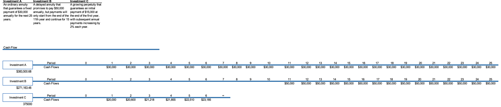

# Applied Financial Math for Decision-Making Project

This Excel-based project shows and demonstrates the application of financial mathematics for strategic investment decision-making. The project has five cases, each addressing a different financial scenario, with calculations performed in Excel.  

---

## Table of Contents
1. [Case 1: Annuity Valuation](#case-1-annuity-valuation)
2. [Case 2: Money-Weighted and Time-Weighted Returns](#case-2-money-weighted-and-time-weighted-returns)
3. [Case 3: NPV and IRR Analysis](#case-3-npv-and-irr-analysis)
4. [Case 4: Bond Pricing and Current Yield](#case-4-bond-pricing-and-current-yield)
5. [Case 5: Money Market Instrument Evaluation](#case-5-money-market-instrument-evaluation)

---

## Case 1: Annuity Valuation

**Context:**  
As a senior investment advisor at **Dynamic Wealth Management (DWM)**, a leading New York City-based firm managing over $2 billion in assets, you are tasked with guiding high-net-worth clients on investment decisions. One client, **Mr. Thompson**, has received a substantial inheritance and is evaluating three annuity plans. Your role is to determine which plan offers the highest present value to align with his financial goals.

**Objective:**  
Advise Mr. Thompson on the best annuity plan among three options: ordinary annuity, delayed annuity, and growing perpetuity.

**Excel Work:**  
- Calculated Present Value (PV) for each annuity using formulas and Excel’s `PV` function.  
- Ordinary annuity, delayed annuity (discounted to present), and growing perpetuity evaluated using standard financial formulas.  

**Screenshot:**  

**Findings & Recommendation:**  
- Ordinary annuity PV: \$383,500.68  
- Delayed annuity PV: \$271,163.46  
- Growing perpetuity PV: \$375,000.00  
**Recommendation:** Choose the **ordinary annuity**, as it offers the highest present value.

---

## Case 2: Money-Weighted and Time-Weighted Returns

**Context:**  
Emma and David Brooks are preparing for retirement and want to evaluate mutual funds for potential investment. The **OceanBlue Fund** is the most attractive option. Your task is to calculate both money-weighted (IRR) and time-weighted returns to help the clients understand the fund’s performance independent of cash inflows and outflows.

**Objective:**  
Evaluate the OceanBlue Fund to determine which return metric better reflects performance: money-weighted (IRR) vs. time-weighted (geometric mean).

**Excel Work:**  
- Calculated annual cash flows and ending portfolio balances.  
- Used Excel’s `IRR` function for money-weighted returns.  
- Used Excel’s `GEOMEAN` function for time-weighted returns.

**Screenshot:**  

**Findings & Recommendation:**  
- Money-weighted return (IRR): 8.11%  
- Time-weighted return: 9.16%  
**Recommendation:** Time-weighted return is slightly higher and preferred for evaluating fund performance independent of cash flow timing.

---

## Case 3: NPV and IRR Analysis

**Context:**  
James Mercer, Chief Investment Officer at **Orion Technologies Inc.**, is considering opening a semiconductor manufacturing facility for tablets. Each potential facility involves different capital outflows and cash flows. Using the company's opportunity cost of capital (12%), your task is to evaluate which facility provides the best financial return.

**Objective:**  
Recommend the best facility investment option for Orion Technologies based on NPV and IRR calculations.

**Excel Work:**  
- Calculated NPV using Excel’s `NPV` function.  
- Calculated IRR using Excel’s `IRR` function.  
- Compared multiple cash flow scenarios and noted IRR limitations when multiple sign changes occur.

**Screenshot:**  

**Findings & Recommendation:**  
- Facility 1: NPV < Facility 2  
- Facility 2: NPV = \$1.72mn, IRR = 21.66%  
- Facility 3: IRR not reliable  
**Recommendation:** Choose **Facility 2** for highest NPV and reliable IRR.

---

## Case 4: Bond Pricing and Current Yield

**Context:**  
Andrew Thompson is seeking to diversify his portfolio with fixed-income securities. He is considering three bonds with different coupon rates, maturities, and compounding periods. Your task is to calculate the market price and current yield of each bond to determine the most attractive option.

**Objective:**  
Determine which bond among three fixed-income securities provides the highest current yield.

**Excel Work:**  
- Calculated bond prices using present value formulas.  
- Computed current yield as `Annual Coupon Payment / Current Price`.  

**Screenshot:**  

**Findings & Recommendation:**  
- Bond A: 6.21%  
- Bond B: 4.35%  
- Bond C: 7.85%  
**Recommendation:** Choose **Bond C** for the highest current yield.

---

## Case 5: Money Market Instrument Evaluation

**Context:**  
Lisa Moore is exploring money market instruments for short-term investment. Three options are available with varying prices, face values, and maturities. Your task is to calculate HPY, EAY, and MNY to help Lisa choose the most lucrative option.

**Objective:**  
Analyze three money market investments to determine HPY, EAY, and MNY, guiding the client on the most attractive option.

**Excel Work:**  
- Calculated **Holding Period Yield (HPY)**, **Effective Annual Yield (EAY)**, and **Money Market Yield (MNY)** using Excel formulas.  
- Compared yields to recommend the optimal investment.

**Screenshot:**  

**Findings & Recommendation:**  
- Investment 1: EAY = 18.00%, MNY = 16.67%  
- Investment 2: EAY = 14.31%, MNY = 13.53%  
- Investment 3: EAY = 20.71%, MNY = 19.15%  
**Recommendation:** Choose **Investment 3** for the highest effective annual and money market yields.

---

## Notes

- All calculations were performed in Excel using built-in financial functions and formula-driven computations.  
- Data is from 365 Financial Analyst.
